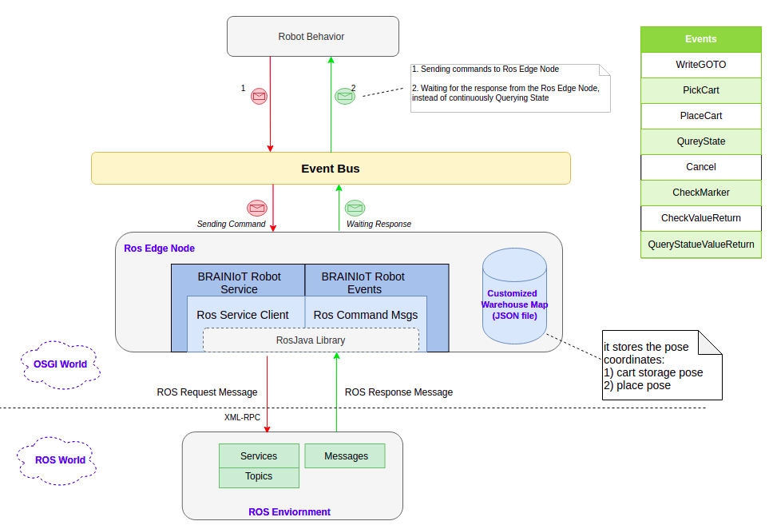

# BRAIN-IoT ROS Edge Node 


This project is an implementation of ROS Edge Node based on the existing [rososgi](https://github.com/ibcn-cloudlet/rososgi) project. The ROS Edge Node provide the connectivity for ROS-based device within an OSGi environment, it exposes the ROS topics/services as OSGi services and integrates with the EventBus developed in BRAIN-IoT Fabric (show as the figure below). Hence, the ROS Edge Node can be packaged as a smart behvior OSGi bundle, deployed in BRAIN-IoT Fabric as a BRAIN-IoT service, and communicate with other BRAIN-IoT services via  EventBus. 

The BRAINIoT events provided by ROS Edge Node can be downloaded from [here](https://repository-pert.polito.it/index.php/apps/files/?dir=/2018-EU-BRAIN-IoT-Partners-Repository/(-)%20Current%20Development/Use%20Cases%20PoCs%20and%20demonstrators/ROB&fileid=12834).
## Requirement
 * Ros distribution: kinetic
 * Ros version:      1.12.14
 * Stage Simulation: [Brain-IoT rb1 simulation](https://git.repository-pert.ismb.it/BRAIN-IoT/brain-iot-rb1-simulation)
 * JDK 1.8 
 * bnd command line tool
 * BNDTool in Eclipse

## Setup
Install Ros system and set up the Ros environment variable `ROS_MASTER_URI=http://localhost:11311` by default in order to set up your local machine as a ROS master.
``` bash
$ source /opt/ros/kinetic/setup.bash
$ printenv | grep ROS
```
Be sure you have installed the BND tool and [Java 8](http://www.oracle.com/technetwork/java/javase/downloads/jdk8-downloads-2133151.html) in your system
``` bash
$ sudo apt-get update
$ sudo apt-get install bnd
```
Install BNDTool IDE in Eclipse
``` bash
Help-> Eclipse Markerplace-> search 'Bndtools'-> Installed->Restart Eclipse.
```

## Tutorial - Try it 
### Quick start:
Run a simulation test to see how it works. 
Start with running a single robot 1 with Stage simulator, here there is no nevigation with the door. 
```bash
#Staring the Brain-IoT Stage simulation
$ roslaunch rb1_brainiot_bringup brainiot_stage.launch world:=~/catkin_ws/src/rb1_brainiot_bringup/worlds/door_map-rb1-base.world
$ roslaunch rb1_brainiot_bringup rb1_base_stage_complete.launch launch_stage:=false launch_rviz:=false

#After Stage simulation is running, download the project
$ git clone https://git.repository-pert.ismb.it/BRAIN-IoT/ros-edge-node.git
$ cd eu.brain.iot.robot.service
$ bnd run test.bndrun
#After the logs stop in the console, press 'Enter' button
g! help             #to see the all possible commands in felix GoGo console
g! test goto 1 4 	  #to move robot_1 to the STORAGE area("y":-3.6,"x":8,"theta":-3.14) in front of cart_1(rb1_base_a_cart2_contact)
g! test pick 1 1    #robot_1 pick cart1
g! test goto 1 5    #move robot_1 to another place {"y":-3.6,"x":8,"theta":-3.14}, just for test
g! test place 1 1   #robot1 place cart1
```
The fellowing is the logs printed:
```bash
	g! test goto 1 4
	inside test!!
	>> Robot 1 received an event: class eu.brain.iot.robot.events.WriteGOTO
	g! 
	GoToComponent: GET GoTo Response: result = ok  state = queued 
	GoToComponent: GET GoTo_Query_State Response: result = ok  state = queued
	GoToComponent: GET GoTo_Query_State Response: result = ok  state = queued
	GoToComponent: GET GoTo_Query_State Response: result = ok  state = queued
	GoToComponent: GET GoTo_Query_State Response: result = ok  state = running
	GoToComponent: GET GoTo_Query_State Response: result = ok  state = running
	GoToComponent: GET GoTo_Query_State Response: result = ok  state = running
	...
 	GoToComponent: GET GoTo_Query_State Response: result = ok  state = finished
	************************************
	RobotId=1 mission=4 result=1
	************************************
```
Then, we can see robot 1 moving to the target position. Also you can run 3 robots simulation in 2D or 3D. But to do this you need to run the simulation from project [Brain-IoT rb1 simulation](https://git.repository-pert.ismb.it/BRAIN-IoT/brain-iot-rb1-simulation).

The following are a sequence of event commands sent from Felix GoGo console to instruct the 3 robots move their carts to the dropping area **(pose PLACE_LEFT, PLACE_CENTER, PLACE_RIGHT)** separatly in the ROS simulation locally: (requires to run the `launch.bndrun` which will start `orchestrator & door` bundles together for opening door at the startup of the launch file.)

Note: before using all of the cmds below, please import this project in Eclipse following the steps in the next section, then open the `configuration.json` file in the `eu.brain.iot.robot.config` sub-project to uncomment the configs of other two robots.

```bash
$ cd eu.brain.iot.robot.service
$ bnd run launch.bndrun
```

```bash
test goto 1 4      test pick 1 1   test goto 1 2 (PLACE_LEFT)     test place 1 1    # robot1 move cart1 to 'Place_left'
test goto 2 4      test pick 2 2   test goto 2 1 (PLACE_CENTER)   test place 2 2    # robot2 move cart2 to 'Place_center'
test goto 3 4      test pick 3 3   test goto 3 3 (PLACE_RIGHT)    test place 3 3    # robot3 move cart3 to 'Place_right'

cancel goto 1   cancel pick 1   cancel place 1      # cancel a specific task being performed by a robot (robot 1 used here, simular for other robots: 2, 3)

```

## Import the project into Eclipse for Developers

Clone and import all sub-projects in eclipse.
``` bash
$ git clone https://git.repository-pert.ismb.it/BRAIN-IoT/ros-edge-node.git
In Eclipse: Import-> others-> Bndtool -> Existing bnd workspace -> Select the cloned ros-edge-node folder-> Finish; then it may ask you if open bnd perspective, select 'yes';


Note: if you don't see the bnd 'Repository' view in Eclipse, select: Window-> Show View-> Other-> Bndtools-> Repositories.
```
But sometimes it could occur errors when first time building the project in Eclipse after you import it. You can solve the problem by deleting everything in the workspace and re-import the project by using the git tool inside Eclipse.If the Git tooling is not available in your Eclipse, you can install it via the Eclipse installation manager.
```bash
In Eclipse: Import-> Git-> Porjects form Git(with smart import)-> Clone URI-> Enter same URI as above-> Select the cloning branch-> Select the folder to store the project->Finish;

Install Git:Help-> Install new Software…​-> Add…-> Enter Following URL-> Add-> Select everything appeat in box-> Next-> Finish
URL: http://download.eclipse.org/egit/updates
```
>Note: the `cnf` project is a fixed name in the source code of Bnd IDE, it makes a directory a workspace with some built-in plugins and external plugins, just like the .git directory does for git. So don't change its name.\
>So if there is already a cnf project in the bnd workspace, when you want to import the second bnd repository which also contains a cnf project, you must discard it, and just clone&import other sub-projects in the second repository by keeping the `Copy projects into workspace` option is checked.\
>Anyway, just to keep all sub-projects staying together in the same workspace with the cnf project.


### General description of bundles:
The bundles in BRAIN-IoT_ROS-OSGI project can be subdivided in four categories by their functions. They are:

**1.Bundles for ROS Core:**
  - be.iminds.iot.ros.api
  - be.iminds.iot.ros.core
  - be.iminds.iot.ros.msgs.generator

	This set of bundles are for the mapping the ROS core to OSGi enviornment and the implementation of the ROS-related gogo command. 

**2.Bundles for ROS Messages:**
  - org.ros.rosjava_messages.gazebo_mesgs
  - org.ros.rosjava_messages.std_srvs
  - org.ros.rosjava_messages.trajectory_msgs

	This set of bundles are the sets of ROS messages generated by the `ros:generate` command as java messages, they are used by the simulator.

**3.Bundles for Robot Services:**
  - eu.brain.iot.robot.api
  - eu.brain.iot.robot.config
  - eu.brain.iot.robot.msgs
  - eu.brain.iot.robot.service

	This set of bundles implement the OSGi Robot Services, integrate with BRAIN-IoT Fabric EventBus. 

**4.Bundles for Gazebo Simulation:**
  - be.iminds.iot.simulator.api
  - be.iminds.iot.simulator.gazebo

	This set of bundles create a simulation environment of a single robot.

### Usage of specific bundles: 
After running the simulator and the Robot Service,the terminal displays Felix gogo console. Then input the `g!help` command in Felix console to see all the possible commands to get information of the current ROS environment or interact with it.

The Felix gogo commands are composed of two parts separated by a colon: <Command_Scope>:<Command_Function>, when two command functions have the same name, but different scope names, it is neccesary to specify the Command_Scope.

**1.Bundles for ROS Core**
*  **be.iminds.iot.ros.api**: it embeds the basic ros commands(e.g roslaunch, catkinBuild, rosrun) in the Felix GOGO console.
    ``` bash
    ros:catkinBuild             # arguments: (String rosWorkspace, String pkg, String node, String... parameters)
    ros:roslaunch               # arguments: (String rosWorkspace, String pkg, String node, String... parameters)
    ros:rosrun                  # arguments: (String workspace, String pkg, String node, String... parameters)
    ```
*  **be.iminds.iot.ros.core**: it registers a Ros service which can launch the Ros Master.
    ``` bash
    ros:env                # list ROS Environments including the ROS_MASTER_URI
    ros:nodes              # list all active nodes when Ros master is running
    ros:provider           # list all active providers when Ros master is running
    ros:publishers         # list all active publishers when Ros master is running
    ros:services           # list all active services when Ros master is running
    ros:subscribers        # list all active subscribers when Ros master is running
    ros:topics             # list all active topics when Ros master is running
    ```
*  **be.iminds.iot.ros.msgs.generator**: `ros:generate` command can be used in the Felix console when the Ros master is running to convert all available types of the ROS messages to the Java types placed in the `generated_msgs` folder by default, that can then be instantiated as java objects, so in this case ros commands can be directly sent from the Java world to the Ros world through the APIs provided by the [Rosjava](http://rosjava.github.io/rosjava_core/latest/) project (e.g Publisher, Subscriber, ServiceClient, ServiceServer...).
    ``` bash
    ros:generate
    ```
**2.Bundles for ROS Messages**
*  **org.ros.rosjava\_messages.\***: there are three sets of the java messages generated by the `ros:generate` command, they are used by the `be.iminds.iot.simulator.gazebo` project when generating the Gazebo-specific commands, in addition, the needed message jars can be downloaded from the `rosjava_messages` project. However, the differernt Ros and Gazebo version result in the defference with the ros messages definition, a md5sum error might accour, in this case,  the message type classes have to be replaceed with the ones generated by the `ros_generate` command.

    For example, in the `org.ros.rosjava_messages.gazebo_msgs` project, due to the different gazebo version, maybe the original service type `GetModelState.java` have to be replaced with the `GetModelState.java` in generated_msgs folder by the `ros:generate` command, otherwise the md5sum error with accour for the service ***\/gazebo\/get\_model\_state***

**3.Bundles for Robot Service**
* **eu.brain.iot.robot.config**: the funciton of this bundel is the global configuration of robots’ and door’s properties.  the id, name,host and port of each robot can be defined in the configuration file within this bundle. Please check the host address and port number before you run the code. If the door is of local simulation, the value of "host" should be "localhost". If it is running remotely, then the value of "host" should be the remote IP address. 
    ``` json
	...
    "eu.brain.iot.example.robot.Door": {
		"host": "localhost", 
        "port": "8080",
        "id": "ExampleDoor"
    },
    "eu.brain.iot.example.robot.Robot~robotA": {
		"host": "localhost", 
		"port": 8080,
		"name": "rb1_base_a",
		"id": 1
    },
    "eu.brain.iot.example.robot.Robot~robotB": {
		"host": "localhost", 
		"port": 8080,
		"name": "rb1_base_b",
		"id": 2
    }
	...
    ```
	And the eu.barin.iot.robot.service will create the one or more Robot Services instances according to the above configuration file.   
* **eu.brain.iot.robot.api**: this bundle defines the apis and a warehouse for the robot service. In the package of eu.barin.iot.robot.api, it defines the apis for the robot commands(eg.GoToComponent). And in the pacakage of eu.brain.iot.robot.events, it defines the apis for the smart behavior events(eg.WriteGOTO). In package of eu.brain.iot.warehouse, it defines a warehouse which can return specific data objects of the predefined data(coordinates and cart name) in the resources file. 
	Data structure of predefined coordiates
	```json
	"Robots":[
	{
		"id":1,
		"STORAGE":{"y":-3.6,"x":8,"theta":-3.14},
		"UNLOAD":{"y":-3.6,"x":8,"theta":-3.14},
		"PLACEC":{"y":0,"x":0,"theta":-3.14},
		"PLACEL":{"y":-7.75,"x":0,"theta":-3.14},
		"PLACER":{"y":7.75,"x":0,"theta":-3.14}
	},
	...
	```
	Data structure of predefined cart data
	```json
	"Carts":[
	{
		"ID":1,
		"NAME":"rb1_base_a_cart2_contact"
	},
	{
		"ID":2,
		"NAME":"rb1_base_b_cart3_contact"
	},
	{
		"ID":3,
		"NAME":"rb1_base_c_cart4_contact"
	}
	]
	```
	**The predefined data here can be updated,added or deleted. But the data strcutre should not be changed.**
* **eu.brain.iot.robot.service**: this bundle contains the implementations of the apis for robot command defined in the pacakge eu.barin.iot.robot.api. And it also contains the implementation of the robot service and a simple orchestrator for test. When it is running, instances of RobotService will be created according to the configuration in eu.brain.iot.robot.config. And each service can send(receive) specific event to(from) the eventBus as well as send requests(receive responses) to(from) the ros robot. In order to test the evets, here a simple orchestrator is created,  trigger it by using the command in Felix console as below:
	```bash
	Orchestrator:test 				# arguments: (String behavior, Integer id, Integer mission)
	```
	In order to run the robot service, we should do as mentioned in quick start , first run the simluator, then run the following command in another terminal:
	```bash
	$ cd ~/brain-iot_ros-osgi/eu.brain.iot.robot.service
	$ bnd run test.bndrun
	```
	And then, after the terminal is not printing message(which means the robot service is finished initialization) and "g!" is displayed as the last ouput, execute the "test" command and robot in the simulation will be running and the terminal will also print messages as this:
	```bash
	g! test goto 1 4
	inside test!!
	>> Robot 1 received an event: class eu.brain.iot.robot.events.WriteGOTO
	g! 
	GoToComponent: GET GoTo Response: result = ok  state = queued 
	GoToComponent: GET GoTo_Query_State Response: result = ok  state = queued
	GoToComponent: GET GoTo_Query_State Response: result = ok  state = queued
	GoToComponent: GET GoTo_Query_State Response: result = ok  state = queued
	GoToComponent: GET GoTo_Query_State Response: result = ok  state = running
	GoToComponent: GET GoTo_Query_State Response: result = ok  state = running
	GoToComponent: GET GoTo_Query_State Response: result = ok  state = running
	...
 	GoToComponent: GET GoTo_Query_State Response: result = ok  state = finished
	************************************
	RobotId=1 mission=4 result=1
	************************************
	Orchestrator Received an event type class eu.brain.iot.robot.events.QueryStateValueReturn
	```
	Most of these messages here are the response messages to the robot service from the robot. Only the one between two "*" lines is the data the orchestrator received after the mission is finished. And in this project, the numbers have the following meanings:
	```bash
	----GotoMission---------CancleMission----QueryMission----Result
	0-------------------------------------------------------“error”
	1---“PLACE CENETR”--------------------------------------“finished”
	2---“PLACE LEFT”----------------------------------------“queued”
	3---“PLACE RIGHT”--------“CancleGoTo”---“QueryGoTo”-----“running”
	4---“STORAGE”-------------------------------------------“paused”
	5---“UNLOAD”--------------------------------------------“unknown”
	7-----------------------“CanclePick”-----“QueryPick”
	11----------------------“CanclePlace”----“QueryPlace”
	```
 
**4.Bundles for simulator**
*  **be.iminds.iot.simulator.gazebo**: it's an example of using the generated java types of the messages`(gazebo_msgs, trajectory_msgs, std_srvs)` to send/receive some requests/responses to control the Gazebo simulation process.

	The individual System properties can be set in the configuration file config.properties in the root of this bundle.

	```bash
	gazebo.launch=true			# Set it true to just open the Gazebo simulator without running a simulation to use `loadScene` command, but as a dependency bundle for the simulation manager, it's false
	ros.core.native=true			# Indicating if launching the installed native ROS system or the rosjava ROS core implementation of the rosjava_core project
	verbosity=2					# Selected verbosity level: 0 NO_OUTPUT, 1 ONLY_ERROR, 2 ALL
	ros.master.uri=http://localhost:11311		# It is used to manually indicate the Ros environment variable in case the user doesn't set it during the Ros installation
	org.apache.felix.log.storeDebug=false		# Configuration of org.apache.felix.log bundle to determine whether or not debug messages will be stored in the history
	felix.fileinstall.dir=resources			# Configuration of org.apache.felix.fileinstall bundle
	org.osgi.service.http.port=8080			# The default port used for Felix servlets and resources available via HTTP
	logback.configurationFile=resources/logback.xml	# Configuration of ch.qos.logback.core bundle
	```

	To run the gazebo simulation, run it in terminal:

	```bash
	$ cd ~/brain-iot_ros-osgi/be.iminds.iot.simulator.gazebo
	$ bnd run gazebo.bndrun
	```
	Also it also can be run in Eclipse, but you need to first run roscore in terminal with:
	```bash
	$ roscore
	```
	and then:
	```bash
	Right click `gazebo.bndrun` -> Run as -> Bnd OSGi Run Launcher. 
	```
	Then:
	```bash
	   g! help
		gazebo:start                # start the simulation, optionally pass two arguments(boolean sync, float step) to start: 1. sync: set to true to control simulator ticks; 2. step: time (in seconds) to advance the simulator each tick
		gazebo:stop                 # stop the simulation 
		gazebo:pause                # pause the simulation 
		gazebo:tick                 # Advance simulation with one tick, only applies when started with sync=true
		gazebo:loadScene            # load a single model that is as a scene, the model could be a .sdf or .urdf file, e.g: $ loadScene robot.sdf
		gazebo:getPosition          # get the position of an object, e.g: getPosition object_name
		gazebo:setPosition
	   ...
	```
    
    You can see a `generated_msgs` folder under this project if you run `generate` command in the GOGO console.
    For more approaches to launch a bndrun file, please refer to the `Run` session in [StageManagerBundle Repository](https://git.pertforge.ismb.it/rzhao/StageManagerBundle.git) .

## Dependency Bundles Updation

Usually the bundle verion is defined by the `Bundle-Version:` instruction in the bnd.bnd file for each project. when you modify something of a bundle in Eclipse, the Bndtool IDE will autocatically update the bundle jar in the `generated` folder. Double click the generated bundle, you can see its version and some other infomation.

When a project refers to the other project in the same workspace, the jar to be refered are the ones in the generated folder of each project, the version of the refered jar in the `-buildpath:` instruction in bnd.bnd file is usually equal to `latest` if you add this bundle from the `build` tab. but you can also set the version equal to the real value from `source` tab. Anyway, Bndtool will hundle any other things for you.

As we said before, the `cnf` project has some build-in plugins and external plugins, they provides lots of available bundles. we can manually add and update the provided bundles

***steps:***
*  Copy the new version of a jar into any place in Eclipse;
*  Drag and drop this jar to Local repository of the `cnf` project from the `Repositories` view in Eclipse to overwrite the old jar;
*  Extend the Local repository, if the version is different with the old one, you can see multiple versions of the jar;
*  In case there are multiple versions, you should modify the version of this new jar in the bnd.bnd file for each project which refers this dependency bundle, and the .bndrun file 

In a conclusion, if in the same workspace, just need to change the source of the refered project, Bndtool will detect where is the latest version. If subdeviding the workspace, you need to drag the new jar in local repository in the bnd Repositories View, and if the version is different, also change the version in the bnd.bnd for each project.

